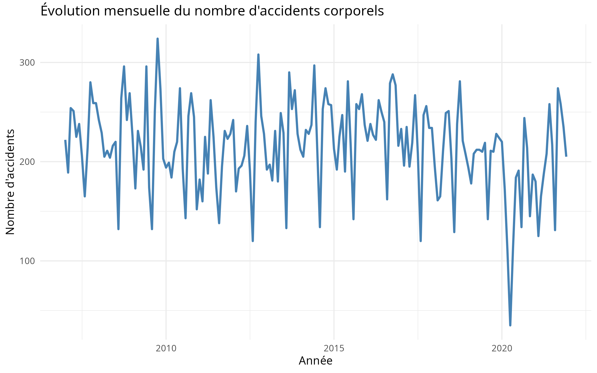
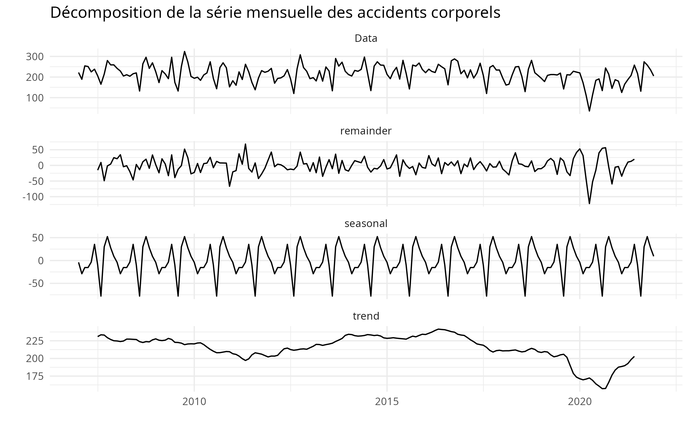
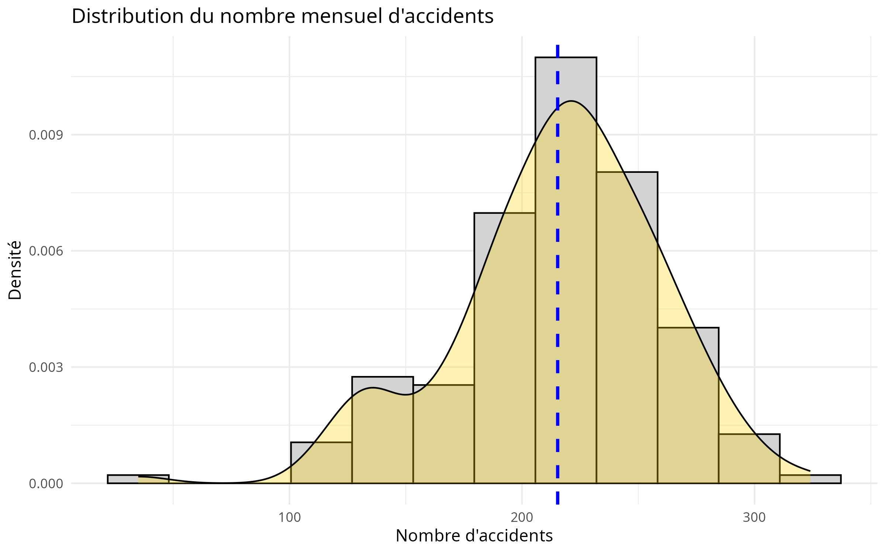
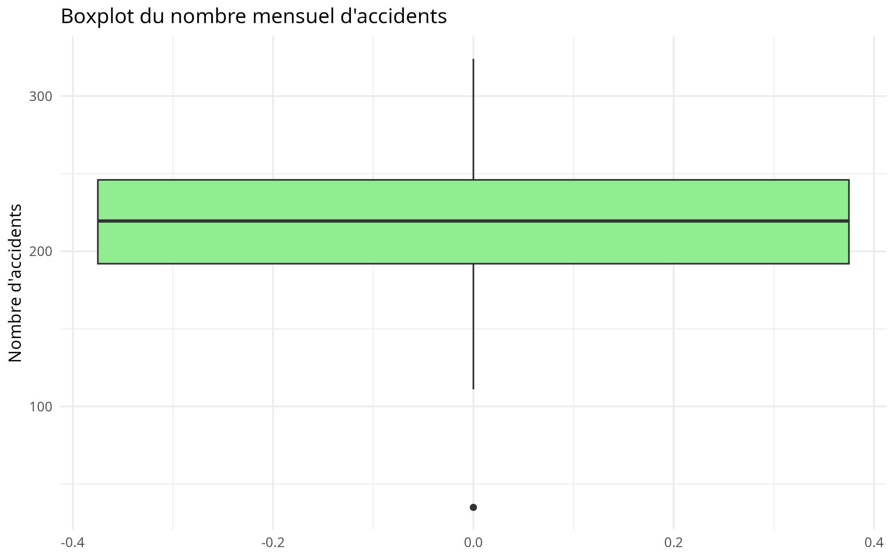
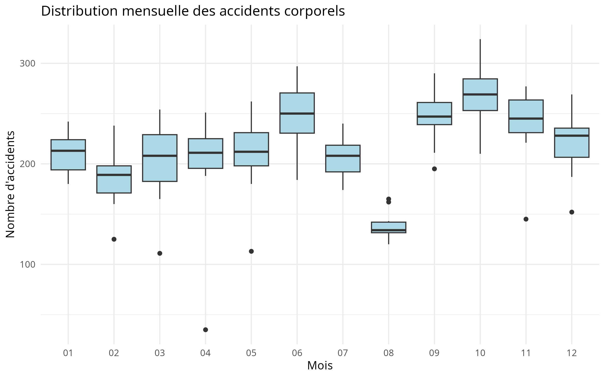
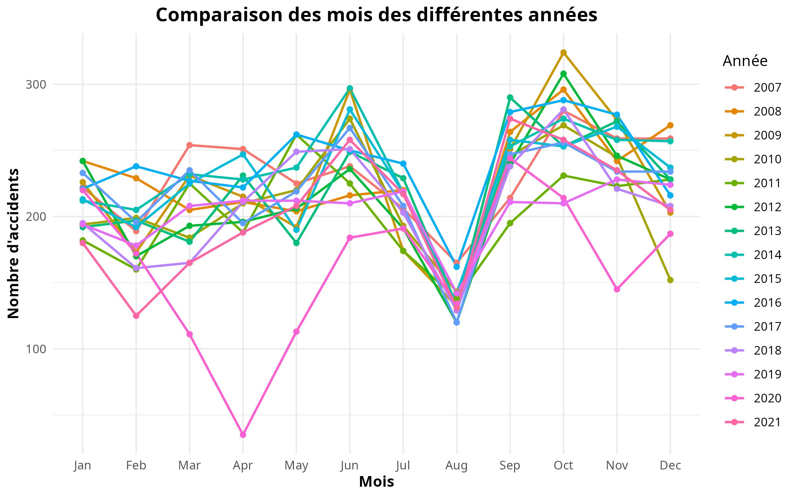
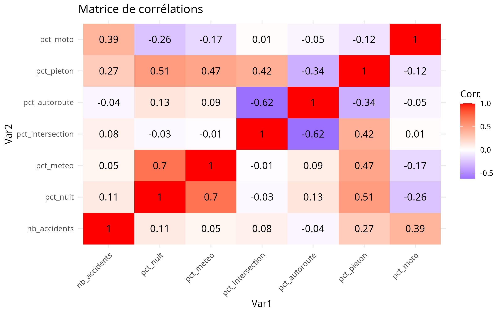
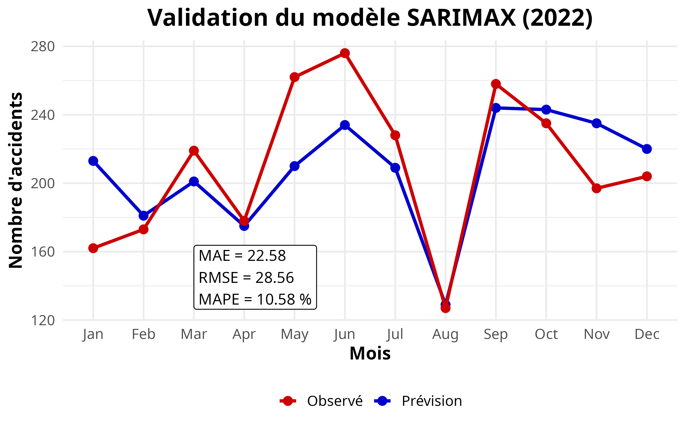

# Modélisation de la Sinistralité Routière par SARIMAX

## Prévision des accidents corporels dans les Hauts-de-Seine (92)

---

## Rapport complet

Ce projet d'actuariat porte sur la modélisation et la prévision du nombre mensuel d'accidents corporels de la circulation dans les Hauts-de-Seine (92).

**[Consulter le rapport complet en ligne](https://magda242424.github.io/Projet_actuariat/)**

**[Consulter le code source R Markdown](./_Projet_Actuariat_.Rmd)**

Le rapport complet présente l'ensemble de la démarche, depuis la préparation des données jusqu'à la validation des prévisions.

---

# 1. Présentation du projet

L'objectif est de construire un modèle de séries temporelles capable de prévoir l'évolution mensuelle de la sinistralité routière à partir :

* des données historiques de la Base des Accidents Corporels de la Circulation (BAAC) ;
* de variables explicatives décrivant les caractéristiques des accidents ;
* de la dynamique temporelle et de la saisonnalité mensuelle.

Le projet couvre l'ensemble de la chaîne de traitement :

**Données → Nettoyage → Analyse exploratoire → Création des variables → Modélisation SARIMAX → Validation croisée → Prévision → Validation externe**

---

# 2. Objectifs

Les principaux objectifs sont :

* analyser l'évolution temporelle de la sinistralité routière ;
* identifier la saisonnalité des accidents corporels ;
* étudier les caractéristiques des accidents ;
* construire des variables explicatives mensuelles ;
* vérifier la stationnarité de la série ;
* sélectionner les variables exogènes pertinentes ;
* comparer différents modèles SARIMAX ;
* utiliser une validation en fenêtre croissante ;
* mesurer les performances prédictives ;
* réaliser une validation externe sur les données de l'année 2022.

---

# 3. Données utilisées

## Données historiques

Les données historiques couvrent la période **2006–2021**.

Elles proviennent de sources publiques officielles :

* Base des Accidents Corporels de la Circulation (BAAC) ;
* data.gouv.fr ;
* bases de données annuelles des accidents corporels de la circulation routière.

Les données sont utilisées pour construire une série mensuelle du nombre d'accidents corporels dans le département des Hauts-de-Seine (92).

## Données de validation externe

La validation hors échantillon est réalisée sur l'année **2022**.

Les observations réelles utilisées pour cette validation proviennent notamment du :

* Baromètre de la Sécurité Routière – Décembre 2022 ;
* DRIEAT Île-de-France ;
* Préfecture de la Région Île-de-France.

Quelques valeurs observées :

| Mois     | Nombre d'accidents |
| -------- | -----------------: |
| Janvier  |                162 |
| Mai      |                262 |
| Juin     |                276 |
| Août     |                127 |
| Décembre |                204 |

**Total annuel 2022 : 2 519 accidents corporels**

---

# 4. Architecture des données

Les données sont stockées dans une base de données MySQL appelée :

```text
projet_actuariat
```

## Tables principales

### `accidents`

Données brutes issues de la BAAC.

### `accidents_propre`

Données nettoyées et préparées pour l'analyse.

## Vue SQL

La vue :

```text
accidents_mensuels
```

permet de calculer les indicateurs mensuels utilisés pour la modélisation :

* nombre mensuel d'accidents ;
* proportion de motocyclistes (`pct_moto`) ;
* proportion d'accidents de nuit (`pct_nuit`) ;
* indicateurs météorologiques ;
* autres variables agrégées.

Les scripts SQL sont disponibles dans le dossier [sql](./sql/).

---

# 5. Analyse exploratoire

L'analyse exploratoire permet d'étudier la dynamique temporelle de la sinistralité routière.

Elle porte notamment sur :

* l'évolution mensuelle du nombre d'accidents ;
* la tendance temporelle ;
* la saisonnalité ;
* la décomposition de la série ;
* la distribution de la variable cible ;
* la distribution mensuelle ;
* les comparaisons interannuelles ;
* les corrélations entre les variables.

## 5.1 Évolution mensuelle de la sinistralité

L'évolution mensuelle permet d'observer la dynamique du nombre d'accidents corporels sur l'ensemble de la période étudiée.



---

## 5.2 Décomposition de la série temporelle

La décomposition permet d'identifier les différentes composantes de la série :

* tendance ;
* saisonnalité ;
* résidus.



---

## 5.3 Distribution de la variable cible

L'analyse de la distribution du nombre d'accidents permet d'étudier la dispersion de la variable cible et sa concentration autour de ses valeurs centrales.



---

## 5.4 Boxplot de la variable cible

Le boxplot permet d'analyser la dispersion du nombre d'accidents et d'identifier d'éventuelles valeurs atypiques.



---

## 5.5 Distribution mensuelle

L'analyse de la distribution mensuelle permet de mettre en évidence les différences de sinistralité entre les différents mois de l'année.



---

## 5.6 Comparaison interannuelle

La comparaison interannuelle permet d'étudier l'évolution de la sinistralité d'une année à l'autre et d'identifier les années présentant des comportements particuliers.



---

## 5.7 Matrice de corrélations

La matrice de corrélations permet d'étudier les relations entre les différentes variables utilisées dans l'analyse et d'identifier les éventuels problèmes de multicolinéarité.



---

# 6. Stationnarité

La stationnarité constitue une étape essentielle avant la modélisation de la série temporelle.

Les outils utilisés sont :

* test ADF (Augmented Dickey-Fuller) ;
* test KPSS ;
* fonction d'autocorrélation ACF ;
* fonction d'autocorrélation partielle PACF.

La modélisation prend en compte une saisonnalité annuelle de période :

```text
12 mois
```

La série est différenciée afin de tenir compte de la dynamique temporelle et de la saisonnalité.

Une attention particulière est portée à la rupture structurelle associée à la période des confinements de 2020.

---

# 7. Sélection des variables exogènes

Plusieurs variables candidates sont étudiées afin d'identifier celles permettant d'améliorer les performances du modèle.

La sélection repose notamment sur :

* l'analyse de la multicolinéarité ;
* le VIF (Variance Inflation Factor) ;
* une recherche sur grille (Grid Search) ;
* la comparaison des performances ;
* la minimisation du RMSE.

Le VIF maximal observé est :

**2,39**

Ce résultat indique une faible multicolinéarité entre les variables étudiées.

---

# 8. Validation croisée

Les performances des modèles sont évaluées à l'aide d'une validation en **fenêtre croissante (Expanding Window)**.

Cette méthode permet de reproduire les conditions réelles de prévision.

À chaque étape :

1. le modèle est entraîné sur les observations disponibles ;
2. une prévision est réalisée pour la période suivante ;
3. l'observation réelle est ajoutée à l'échantillon d'apprentissage ;
4. le processus est répété.

Cette approche permet d'évaluer la capacité du modèle à généraliser dans le temps tout en évitant l'utilisation d'informations futures lors de l'entraînement.

---

# 9. Modèle retenu

Après comparaison des modèles candidats, le modèle retenu est :

```text
SARIMAX(2,0,1)(0,1,2)[12]
```

avec comme variable exogène principale :

```text
pct_moto
```

Le modèle intègre :

* une composante autorégressive ;
* une composante moyenne mobile ;
* une différenciation saisonnière ;
* une saisonnalité annuelle de période 12 ;
* une variable explicative liée à la proportion de motocyclistes.

---

# 10. Validation externe sur l'année 2022

Le modèle final est évalué sur les observations réelles de l'année 2022.

Cette validation constitue une évaluation hors échantillon, les observations de 2022 n'étant pas utilisées pour entraîner le modèle historique.

## Performances

| Indicateur |      Valeur |
| ---------- | ----------: |
| **MAE**    |   **22,58** |
| **RMSE**   |   **28,56** |
| **MAPE**   | **10,58 %** |

Le modèle reproduit correctement la dynamique saisonnière globale.

Il permet notamment de restituer :

* le creux estival ;
* le minimum observé en août ;
* la reprise de l'activité à l'automne.

Une légère sous-estimation est observée lors des pics printaniers, notamment en mai et juin.

---

# 11. Visualisation des prévisions

La comparaison entre les valeurs observées et les valeurs prédites permet d'évaluer graphiquement la capacité du modèle à reproduire la dynamique réelle de la sinistralité.



Cette visualisation met notamment en évidence :

* la bonne restitution de la saisonnalité ;
* le creux observé durant l'été ;
* la reprise automnale ;
* le léger lissage des pics printaniers.

---

# 12. Principaux résultats

Le modèle permet de reproduire correctement la dynamique temporelle globale du nombre d'accidents corporels.

Les principaux résultats sont :

* présence d'une saisonnalité annuelle marquée ;
* creux de sinistralité au mois d'août ;
* reprise de la sinistralité à l'automne ;
* bonne capacité de généralisation sur les données de 2022 ;
* MAE de **22,58 accidents** ;
* RMSE de **28,56 accidents** ;
* MAPE de **10,58 %**.

Le modèle présente néanmoins un léger lissage des pics de sinistralité observés au printemps, notamment en mai et juin.

---

# 13. Technologies utilisées

## Langages

* R
* SQL

## Base de données

* MySQL

## Packages R

* `dplyr`
* `ggplot2`
* `forecast`
* `tseries`
* `lmtest`
* `car`
* `DBI`
* `RMySQL`

## Outils

* R Markdown
* MySQL
* Git
* GitHub
* GitHub Pages

---

# 14. Structure du dépôt

```text
Projet_actuariat/
│
├── README.md
│
├── _Projet_Actuariat_.Rmd
│   └── Code source complet du rapport
│
├── docs/
│   └── index.html
│       └── Rapport HTML
│
├── graphics/
│   ├── 01_evolution_mensuelle.png
│   ├── 02_decomposition.png
│   ├── 03_distribution_de_la_variable_cible.png
│   ├── 04_boxplot_de_la_Variable_cible.png
│   ├── 05_distribution_mensuelle.png
│   ├── 06_Comparaison_interannuelle.png
│   ├── 07_Matrice_de_corrélations.png
│   └── 08_Visualisation_des_prévisions.png
│
└── sql/
    ├── create_tables.sql
    └── create_view.sql
```

---

# 15. Accès aux fichiers

## Rapport HTML

[Consulter le rapport complet en ligne](https://magda242424.github.io/Projet_actuariat/)

## Code source

[Consulter le fichier R Markdown](./_Projet_Actuariat_.Rmd)

## Scripts SQL

[Consulter les scripts SQL](./sql/)

## Graphiques

[Consulter le dossier des graphiques](./graphics/)

---

# 16. Conclusion

Ce projet met en œuvre une démarche complète de modélisation actuarielle appliquée à la prévision de la sinistralité routière.

L'approche combine :

**SQL → préparation des données → analyse exploratoire → analyse statistique → séries temporelles → SARIMAX → validation croisée → validation externe**

Le modèle final :

```text
SARIMAX(2,0,1)(0,1,2)[12]
```

avec `pct_moto` comme variable exogène principale, obtient sur les données de validation 2022 :

**MAPE = 10,58 %**

Le modèle restitue correctement la dynamique saisonnière globale des accidents corporels dans les Hauts-de-Seine, notamment le creux du mois d'août et la reprise automnale.

Il présente cependant un léger lissage des pics printaniers observés en mai et juin.

Ce projet illustre l'application d'une méthodologie de modélisation statistique et actuarielle à la prévision de la sinistralité, en combinant gestion des données, SQL, analyse statistique, séries temporelles et évaluation prédictive.

---

## Projet d'actuariat

Projet réalisé dans le cadre d'un travail de modélisation actuarielle appliquée à la prévision de la sinistralité routière.
